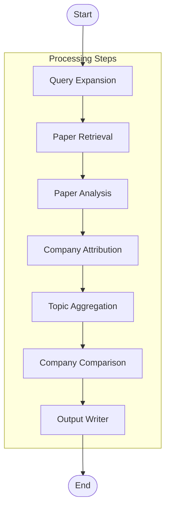

# Researcher AI Agent

A robust, modular AI-powered research agent capable of conducting deep-dive analysis on academic topics using arXiv papers and Large Language Models (LLMs).

## Features

-   **Multi-Step Research Workflow**: Automated pipeline from query expansion to final report generation.
-   **Intelligent Paper Retrieval**: Expands topics into search queries to find relevant papers on arXiv.
-   **Deep Analysis**: specific analysis of papers for contributions, methods, datasets, and limitations using LLMs.
-   **Company Attribution**: Identifies company and institution affiliations from author lists.
-   **comparative Analysis**: Aggregates statistics per topic and compares top companies/institutions based on their research output.
-   **Structured Output**: Generates JSON data, execution logs, and professional markdown summary reports.

## Architecture

The system uses **LangGraph** to coordinate a stateful workflow. Below is the high-level architecture:



## Installation

### Prerequisites

-   Python 3.8+
-   Google Gemini API Key (or OpenAI API Key if configured)

### Setup

1.  Clone the repository.
2.  Install dependencies:
    ```bash
    pip install -r requirements.txt
    ```
3.  Create a `.env` file in the root directory and add your API credentials:
    ```env
    GOOGLE_API_KEY=your_api_key_here
    # OPENAI_API_KEY=your_key_if_using_openai
    ```

## Usage

The project is structured with a clean entry point.

1.  Open `main.py` and modify the topics list if desired:
    ```python
    results = await system.analyze_topics([
        "Your Research Topic Here",
    ])
    ```
2.  Run the agent:
    ```bash
    python main.py
    ```

## Project Structure

This project follows a modular architecture:

```text
project_root/
├── main.py                 # Entry point application
├── src/
│   ├── __init__.py
│   ├── models.py           # Data definitions (Paper, ResearchState, etc.)
│   ├── utils.py            # Utilities (ResultsManager for file I/O)
│   └── research_system.py  # Core research logic and LangGraph workflow
├── research_output/        # Generated results (created automatically)
└── requirements.txt        # Project dependencies
```

## Output

For each run, a new timestamped directory is created in `research_output/` (e.g., `research_output/run_20240101_120000/`) containing:

-   `analysis.json`: The complete structured data of the analysis.
-   `execution.log`: Detailed logs of the system's operations.
-   `summary_report.md`: A human-readable summary of the research findings.
