# 🧠 Researcher AI Agent

> **An autonomous, state-driven research assistant that turns topics into deep insights.**


The **Researcher AI Agent** is a modular system designed to automate the academic research process. It goes beyond simple summarization by performing quantitative analysis, attributing research to institutions, and identifying strategic gaps in current literature—all orchestrated by a robust state graph.

---

## 🚀 Key Features

| Feature | Description |
| :--- | :--- |
| **🔍 Intelligent Retrieval** | Expands broad topics into targeted arXiv queries to find high-impact papers. |
| **📊 Deep Analysis** | Extracts key contributions, methods, datasets, and limitations using advanced LLMs. |
| **📈 Visual Analytics** | Automatically generates charts for **publication trends** and **topic distribution**. |
| **🏢 Company Attribution** | Identifies which tech giants and universities are leading specific research areas. |
| **💡 Strategic Insights** | Synthesizes "Gap Analysis" to recommend future research directions. |
| **📄 Professional Reports** | Produces a clean **PDF Report** with embedded charts and tables, ready for distribution. |

---

## 🛠️ Architecture

The system enables a complex, cyclic workflow using **LangGraph**. It's not just a linear chain; it manages state to aggregate data effectively.

```mermaid
graph TD
    Start([🚀 Start]) --> QueryExpansion[🔍 Query Expansion]
    QueryExpansion --> PaperRetrieval[📄 Paper Retrieval]
    PaperRetrieval --> PaperAnalysis[🧠 Paper Analysis]
    
    subgraph "Aggregation & comparison"
        PaperAnalysis --> CompanyAttribution[🏢 Company Attribution]
        CompanyAttribution --> TopicAggregation[📊 Topic Aggregation]
        TopicAggregation --> CompanyComparison[⚖️ Company Comparison]
    end
    
    subgraph "Deep Analysis"
        CompanyComparison --> DeepAnalysis[📈 Quantitative Analysis]
        DeepAnalysis --> GapAnalysis[💡 Gap Analysis]
    end
    
    GapAnalysis --> OutputWriter[📝 Output Generation]
    OutputWriter --> End([🏁 End])

    style Start fill:#4CAF50,stroke:#333,stroke-width:2px,color:white
    style End fill:#F44336,stroke:#333,stroke-width:2px,color:white
    style DeepAnalysis fill:#E3F2FD,stroke:#2196F3,stroke-width:2px
```



### 📂 Modular Codebase

The project structure is designed for scalability:

*   **`src/graph.py`**: 🧠 **The Brain**. Defines the workflow graph.
*   **`src/nodes/`**: 🧩 **The Skills**. Individual capabilities:
    *   `queries.py`, `retrieval.py` (Gathering Data)
    *   `analysis.py`, `deep_analysis.py` (Processing & Visualizing)
    *   `aggregation.py` (Synthesizing)
    *   `output.py` (Reporting)

---

## ⚡ Quick Start

### Prerequisites

*   Python 3.8+
*   Google Gemini API Key

### Installation

1.  **Clone the repository**
2.  **Install dependencies**:
    ```bash
    pip install -r requirements.txt
    ```
3.  **Configure Environment**:
    Create a `.env` file in the root directory:
    ```env
    GOOGLE_API_KEY=your_api_key_here
    ```

### Usage

1.  **Define your topics** in `main.py`:
    ```python
    results = await system.analyze_topics([
        "Retrieval Augmented Generation",
        "Multi-Agent Reinforcement Learning"
    ])
    ```

2.  **Run the agent**:
    ```bash
    python main.py
    ```

---

## 📄 Output Artifacts

Every run generates a dedicated folder in `research_output/` containing:

1.  **`research_report.pdf`**: A professional, formatted report with:
    *   Executive Summary
    *   Embedded Visualization Charts
    *   Company Rankings Table
    *   Strategic Recommendations
2.  **`analysis.json`**: Full raw data for downstream processing.
3.  **`charts/`**: High-quality PNG images of generated graphs.
4.  **`summary_report.md`**: Quick-read markdown summary.

---

## 🔮 Future Roadmap

*   [ ] Integration with more academic sources (Semantic Scholar, IEEE).
*   [ ] Interactive Streamlit Dashboard for real-time visualization.
*   [ ] Support for local LLMs (Ollama/Llama 3).
